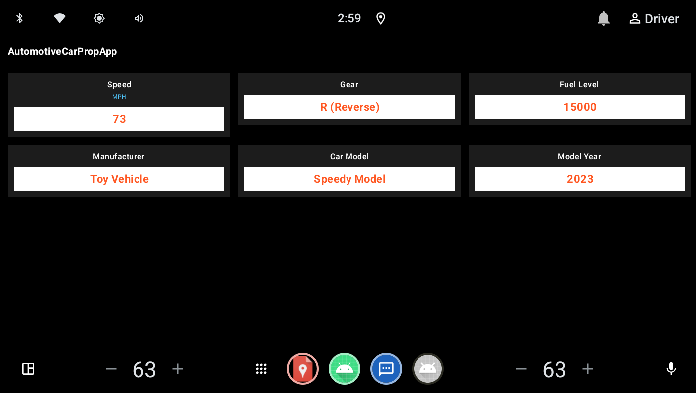

# Capstone

An **Android Automotive OS** app that connects to the vehicle's Car service and
displays live VHAL properties — speed, gear, fuel level, and vehicle identity — on a
single dashboard screen.

Kotlin · Jetpack Compose · Android 15+ (API 35) · AAOS emulator



---

## Contents

- [What it does](#what-it-does)
- [Architecture](#architecture)
- [Getting started](#getting-started)
- [Running it](#running-it)
- [Known limitations](#known-limitations)
- [Tech stack](#tech-stack)

---

## What it does

On launch, the app requests the `CAR_SPEED` and `CAR_ENERGY` runtime permissions,
then connects to `Car` and registers for VHAL property updates. Six live values are
rendered as cards in a 3-column grid:

| Card | Source property | Update mode |
|---|---|---|
| Speed (MPH) | `PERF_VEHICLE_SPEED` | `SENSOR_RATE_ONCHANGE` |
| Gear | `GEAR_SELECTION` | `SENSOR_RATE_ONCHANGE` |
| Fuel Level | `FUEL_LEVEL` | `SENSOR_RATE_ONCHANGE` |
| Manufacturer | `INFO_MAKE` | read once on connect |
| Car Model | `INFO_MODEL` | read once on connect |
| Model Year | `INFO_MODEL_YEAR` | read once on connect |

Speed arrives from the VHAL in metres per second and is converted to MPH for
display. `GEAR_SELECTION` arrives as a bitmask (`CarPropertyRepository.gearToLabel`)
and is mapped to a human-readable label (P / R / N / D / 1–5).

`CAR_POWERTRAIN` and `CAR_INFO` are declared in the manifest as normal permissions
(granted at install time); `CAR_SPEED` and `CAR_ENERGY` are runtime permissions
requested via `ActivityResultContracts.RequestMultiplePermissions`.

---

## Architecture

```
VHAL ──► CarPropertyManager ──► CarPropertyRepository (StateFlow<CarUiState>)
                                                │
                                        MainActivity ──► CarDashboardScreen (Compose)
```

`CarPropertyRepository` owns the `Car` connection and the property callback; it
exposes a single immutable `CarUiState` as a `StateFlow`. The UI observes that state
with `collectAsStateWithLifecycle` and renders it — there is no `ViewModel` in
between, so the repository is held directly by the `Activity` and reconnects
whenever the `Activity` is recreated.

```
app/src/main/java/com/example/capstone/
├── CarPropertyRepository.kt   Car connection, VHAL callback registration, unit
│                              conversion, CarUiState
└── MainActivity.kt            Permission request flow, Compose UI
                               (CarDashboardScreen, PropertyCard)
```

The project compiles against the Car API via `app/libs/android-car-stub.jar`
(`compileOnly`), which is what lets `android.car.*` resolve without a real device or
emulator present at build time. A second jar, `android.car.jar`, sits alongside it in
`libs/` but is not currently wired into the Gradle build.

---

## Getting started

### 1. Prerequisites

- **Android Studio**, with a JDK 17-compatible toolchain (bundled with recent
  Android Studio releases)
- **Android SDK Platform 37** (`compileSdk`/`targetSdk`), installed via
  *Tools → SDK Manager*

### 2. Install an Automotive system image

Under *SDK Manager → SDK Platforms*, tick **Show Package Details** and install an
**Automotive** or **Automotive with Google APIs** image for API 35 or newer
(`minSdk` is 35).

> ⚠️ **Avoid "Automotive with Play Store" images.** Those images withhold the Car
> API for apps not distributed through Play, so `CarPropertyManager` calls in this
> app will fail. Use a plain "Automotive" or "Automotive with Google APIs" image.

### 3. Create an Automotive AVD

*Tools → Device Manager → Add device*, set **Category = Automotive**, pick a
hardware profile, and confirm the system image name contains **Automotive**. Boot it
once before running the app.

### 4. Open and run

*File → Open*, select this project's root folder (the one containing
`settings.gradle.kts`), let Gradle sync, then run the **app** configuration against
the Automotive AVD.

On first launch you'll be prompted to grant the **Car speed** and **Car energy**
permissions — grant both, or the Speed and Fuel Level cards stay at their default
values.

---

## Running it

Everything is driven from the emulator's **Extended controls** panel — the `⋯`
button on the emulator toolbar — under **Car data → Car sensor data**. Changes take
effect in the app immediately, since the app is subscribed to VHAL updates while
it's in the foreground.

- **Speed** — the **Car speed** slider. Set the unit dropdown (mph/kmph) to whatever
  is convenient; the app reads the underlying value in metres/second and converts it
  to MPH itself, so the display unit of the slider doesn't need to match.
- **Gear** — the **Gear** selector. Pick **P (Park)**, **R (Reverse)**, **N
  (Neutral)**, **D (Drive)**, or a numbered gear; the card updates to match.

`FUEL_LEVEL` and the static identity properties (`INFO_MAKE`, `INFO_MODEL`,
`INFO_MODEL_YEAR`) don't have their own named slider — the **Car sensor data** tab
also exposes a searchable list of every VHAL property, where you can look up a
property by name (e.g. "Fuel level") and set its value directly the same way. The
identity properties are read once when the app connects, so change them *before*
launching the app (or relaunch the app afterwards) rather than expecting a live
card update.

### A quick sequence to see everything update

1. Launch the app and grant the **Car speed** / **Car energy** permissions.
2. In **Car sensor data**, drag **Car speed** up — the Speed card follows in real
   time.
3. Set **Gear** to **D (Drive)** — the Gear card switches from `--` to `D (Drive)`.
4. Look up **Fuel level** in the property list and set a value — the Fuel Level card
   updates.

---

## Known limitations

- **Only two of the four car permissions are actually requested from the user.**
  `requiredCarPermissions` in `MainActivity` covers `CAR_SPEED` and `CAR_ENERGY`
  only, because those are `protectionLevel="dangerous"` and need a runtime prompt.
  `CAR_POWERTRAIN` (used for `GEAR_SELECTION`) and `CAR_INFO` (used for
  `INFO_MAKE`/`INFO_MODEL`/`INFO_MODEL_YEAR`) are `protectionLevel="normal"` —
  they're declared in the manifest and silently granted by the OS at install time,
  so the user is never asked to approve them.
- **No real tests.** `ExampleUnitTest` and `ExampleInstrumentedTest` are the default
  Android Studio template scaffolding, not tests written against this app's code.
- **No `ViewModel`.** `CarPropertyRepository` is constructed and connected directly
  in `MainActivity.onCreate`, so it reconnects to `Car` on every `Activity`
  recreation (e.g. configuration change) instead of surviving it.
- **Errors are logged, not surfaced.** A `SecurityException` from a missing
  permission or a VHAL error event is written to Logcat only; the UI gives no
  indication that a card's value is stale or unavailable.
- **Single screen, no persistence.** There's no settings surface, no saved state,
  and no history — the UI always reflects only the latest VHAL sample.

---

## Tech stack

| | |
|---|---|
| Language | Kotlin |
| UI | Jetpack Compose (Material 3) |
| Async | Kotlin Coroutines + `StateFlow` |
| Vehicle data | `android.car` (`CarPropertyManager`), compiled via `android-car-stub.jar` |
| Build | AGP 9.2.1, Kotlin 2.1.0 |
| Min / target / compile SDK | 35 / 37 / 37 |
